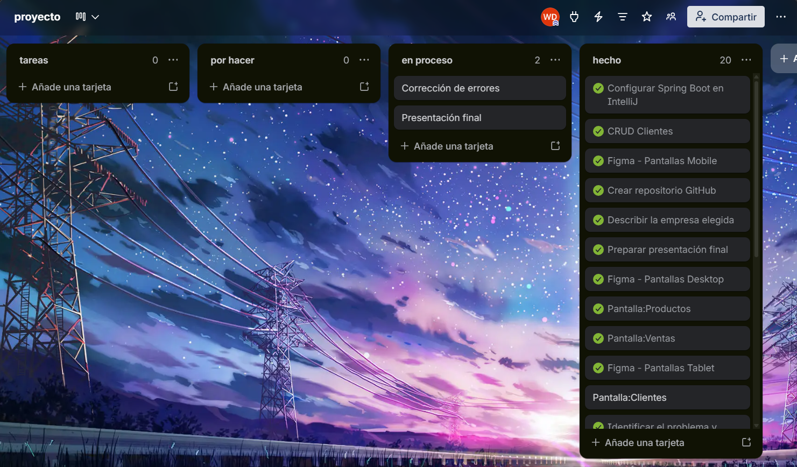
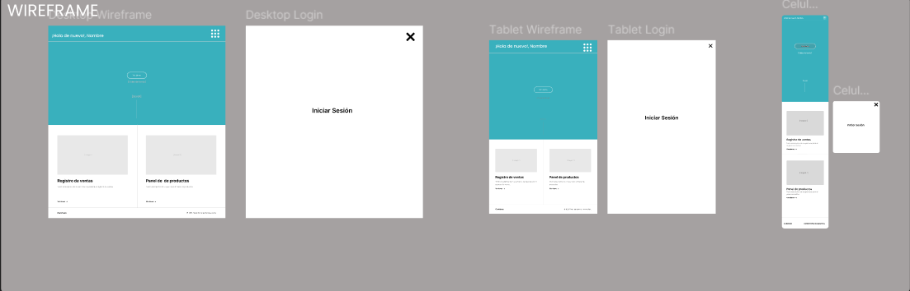
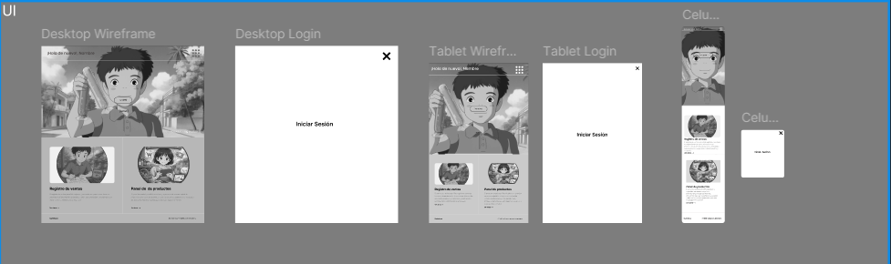
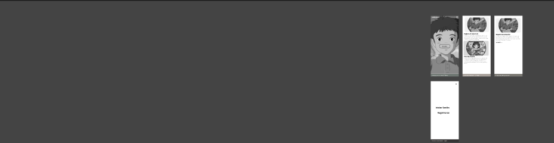
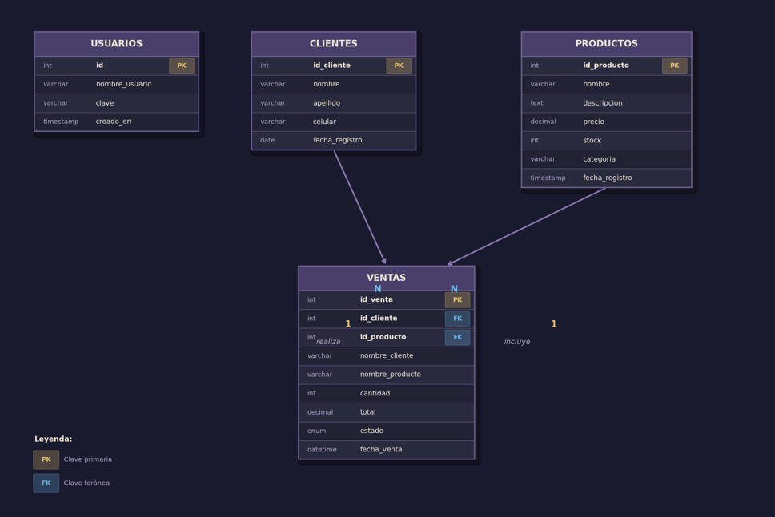
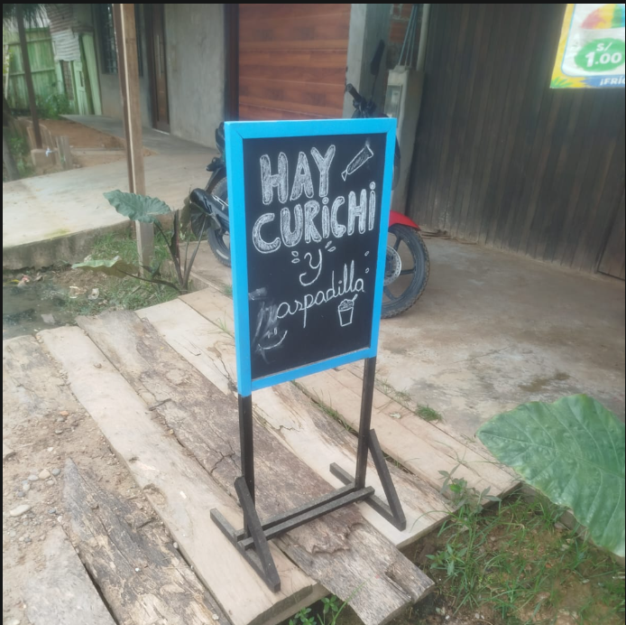
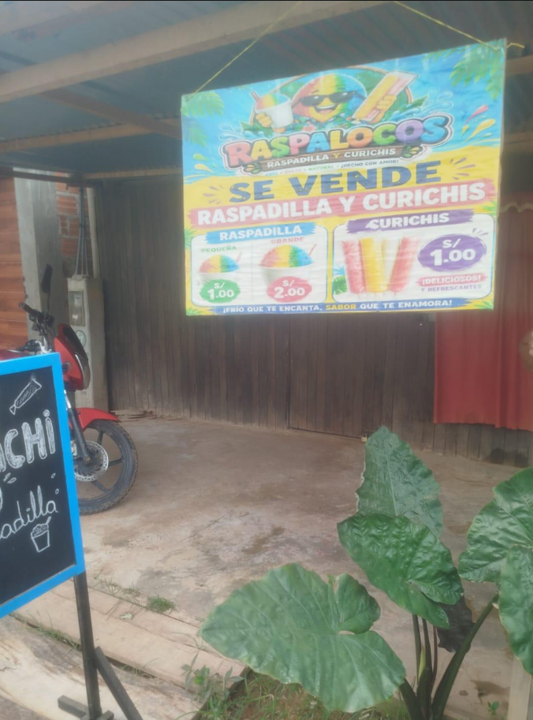

# Sistema de Ventas - Curichis y Marcianos
**TRELLO**


Aplicacion web desarrollada en PHP puro con arquitectura MVC, PDO y MySQL/MariaDB. Permite iniciar sesion, administrar clientes, productos, usuarios y registrar ventas descontando stock automaticamente.


| Código | Descripción |
|---|---|
| RF01 | El sistema debe permitir registrar un nuevo cliente con nombre, apellido y teléfono |
| RF02 | El sistema debe permitir registrar una venta indicando comprador, producto, cantidad y fecha |
| RF04 | El sistema debe mostrar el listado de todos los productos en stock |

## Requerimientos No Funcionales

| Código | Tipo | Descripción |
|---|---|---|
| RNF01 | Rendimiento | El sistema debe cargar cada pantalla en menos de 3 segundos |
| RNF02 | Usabilidad | La interfaz debe ser intuitiva y fácil de usar sin necesidad de capacitación previa |
| RNF03 | Seguridad | Solo usuarios autorizados podrán acceder al sistema mediante correo y contraseña |
| RNF04 | Responsividad | El sistema debe funcionar correctamente en dispositivos móviles y desktop |

## Figma
**Wireframe**



## Ui



## Ux



## Funcionalidades

- Login con sesiones PHP.
- CRUD de clientes.
- CRUD de productos.
- CRUD de usuarios.
- Registro de ventas con validacion de stock.
- Reporte y detalle de ventas.
- Conexion a MySQL usando variables de entorno en `.env`.

## Tecnologias

| Capa | Tecnologia |
| --- | --- |
| Backend | PHP 8+ |
| Base de datos | MySQL / MariaDB |
| Acceso a datos | PDO |
| Frontend | HTML, CSS, JavaScript, Bootstrap |
| Servidor local | Apache con XAMPP |

## Estructura

```text
app/
  config/       Configuracion general y lectura de .env
  controllers/  Controladores MVC
  core/         Router, App, Controller y Database
  models/       Modelos con consultas PDO
  views/        Vistas PHP
public/
  css/          Estilos
  js/           Scripts
  video/        Videos usados por la landing
database.sql    Script para crear la base de datos MySQL
.env.example    Ejemplo de configuracion local
```

## Requisitos

- XAMPP o equivalente con Apache, PHP 8+ y MySQL/MariaDB.
- Navegador web.
- Extension PDO MySQL habilitada en PHP.

## Instalacion

1. Copia la carpeta del proyecto en:

```powershell
C:\xampp\htdocs\entregable_final
```

2. Inicia Apache y MySQL desde el panel de XAMPP.

3. Configura el archivo `.env`:

```env
DB_HOST=localhost
DB_PORT=3306
DB_DATABASE=senai_asistencia
DB_USERNAME=root
DB_PASSWORD=
APP_URL=http://localhost/entregable_final
```

4. Importa la base de datos desde phpMyAdmin o con consola:

```powershell
C:\xampp\mysql\bin\mysql.exe -u root < database.sql
```

Si tu usuario MySQL tiene clave:

```powershell
C:\xampp\mysql\bin\mysql.exe -u root -p < database.sql
```

5. Abre la aplicacion:

```text
http://localhost/entregable_final
```

## Acceso inicial

```text
Usuario: Walter
Clave: 12345
```
## Modelo Relacional



## Base de datos

El archivo `database.sql` crea la base `senai_asistencia` y estas tablas:

- `usuarios`: cuentas para iniciar sesion.
- `clientes`: datos de clientes.
- `productos`: catalogo, precios, stock y categoria.
- `ventas`: venta realizada, cliente, producto, cantidad, total, estado y fecha.

Relaciones:

- `ventas.id_cliente` referencia a `clientes.id_cliente`.
- `ventas.id_producto` referencia a `productos.id_producto`.

  
 ``` sql
CREATE DATABASE IF NOT EXISTS senai_asistencia
  CHARACTER SET utf8mb4
  COLLATE utf8mb4_unicode_ci;

USE senai_asistencia;

SET FOREIGN_KEY_CHECKS = 0;
DROP TABLE IF EXISTS ventas;
DROP TABLE IF EXISTS productos;
DROP TABLE IF EXISTS clientes;
DROP TABLE IF EXISTS usuarios;
SET FOREIGN_KEY_CHECKS = 1;

CREATE TABLE usuarios (
  id INT AUTO_INCREMENT PRIMARY KEY,
  nombre_usuario VARCHAR(150) NOT NULL,
  clave VARCHAR(255) NOT NULL,
  creado_en TIMESTAMP NOT NULL DEFAULT CURRENT_TIMESTAMP,
  UNIQUE KEY uk_usuarios_nombre (nombre_usuario)
) ENGINE=InnoDB DEFAULT CHARSET=utf8mb4 COLLATE=utf8mb4_unicode_ci;

CREATE TABLE clientes (
  id_cliente INT AUTO_INCREMENT PRIMARY KEY,
  nombre VARCHAR(100) NOT NULL,
  apellido VARCHAR(100) NOT NULL,
  celular VARCHAR(20) NULL,
  fecha_registro DATE NOT NULL,
  INDEX idx_clientes_nombre (nombre, apellido)
) ENGINE=InnoDB DEFAULT CHARSET=utf8mb4 COLLATE=utf8mb4_unicode_ci;

CREATE TABLE productos (
  id_producto INT AUTO_INCREMENT PRIMARY KEY,
  nombre VARCHAR(150) NOT NULL,
  descripcion TEXT NULL,
  precio DECIMAL(10,2) NOT NULL,
  stock INT NOT NULL DEFAULT 0,
  categoria VARCHAR(50) NOT NULL,
  fecha_registro TIMESTAMP NOT NULL DEFAULT CURRENT_TIMESTAMP,
  INDEX idx_productos_categoria (categoria),
  CONSTRAINT chk_productos_precio CHECK (precio >= 0),
  CONSTRAINT chk_productos_stock CHECK (stock >= 0)
) ENGINE=InnoDB DEFAULT CHARSET=utf8mb4 COLLATE=utf8mb4_unicode_ci;

CREATE TABLE ventas (
  id_venta INT AUTO_INCREMENT PRIMARY KEY,
  id_cliente INT NOT NULL,
  id_producto INT NOT NULL,
  nombre_cliente VARCHAR(200) NOT NULL,
  nombre_producto VARCHAR(150) NOT NULL,
  cantidad INT NOT NULL,
  total DECIMAL(10,2) NOT NULL,
  estado ENUM('completada', 'cancelada') NOT NULL DEFAULT 'completada',
  fecha_venta DATETIME NOT NULL DEFAULT CURRENT_TIMESTAMP,
  INDEX idx_ventas_fecha (fecha_venta),
  INDEX idx_ventas_cliente (id_cliente),
  INDEX idx_ventas_producto (id_producto),
  CONSTRAINT fk_ventas_clientes
    FOREIGN KEY (id_cliente) REFERENCES clientes(id_cliente)
    ON UPDATE CASCADE
    ON DELETE RESTRICT,
  CONSTRAINT fk_ventas_productos
    FOREIGN KEY (id_producto) REFERENCES productos(id_producto)
    ON UPDATE CASCADE
    ON DELETE RESTRICT,
  CONSTRAINT chk_ventas_cantidad CHECK (cantidad > 0),
  CONSTRAINT chk_ventas_total CHECK (total >= 0)
) ENGINE=InnoDB DEFAULT CHARSET=utf8mb4 COLLATE=utf8mb4_unicode_ci;

INSERT INTO usuarios (nombre_usuario, clave) VALUES
('Walter', '12345');

INSERT INTO clientes (nombre, apellido, celular, fecha_registro) VALUES
('Ana', 'Torres', '999111222', CURDATE()),
('Luis', 'Rojas', '999333444', CURDATE());

INSERT INTO productos (nombre, descripcion, precio, stock, categoria) VALUES
('Curichi de maracuya', 'Curichi artesanal de maracuya.', 2.50, 50, 'Curichi'),
('Marciano de fresa', 'Marciano helado sabor fresa.', 1.50, 80, 'Marciano'),
('Paleta de coco', 'Paleta helada sabor coco.', 3.00, 40, 'Paleta');

INSERT INTO ventas (
  id_cliente,
  id_producto,
  nombre_cliente,
  nombre_producto,
  cantidad,
  total,
  estado,
  fecha_venta
) VALUES (
  1,
  1,
  'Ana Torres',
  'Curichi de maracuya',
  2,
  5.00,
  'completada',
  NOW()
);

UPDATE productos
SET stock = stock - 2
WHERE id_producto = 1;
```

## Rutas principales

- `/` landing page.
- `/login` inicio de sesion.
- `/dashboard` panel principal.
- `/clientes` reporte de clientes.
- `/clientes/registro` nuevo cliente.
- `/productos` reporte de productos.
- `/productos/registro` nuevo producto.
- `/ventas` reporte de ventas.
- `/ventas/registro` nueva venta.
- `/usuarios` reporte de usuarios.
- `/usuarios/registro` nuevo usuario.

## Notas de configuracion

- Si cambias el nombre de la carpeta en `htdocs`, actualiza `APP_URL`.
- Si MySQL usa clave, actualiza `DB_PASSWORD`.
- Si usas otro puerto MySQL, actualiza `DB_PORT`.

## Tienda






